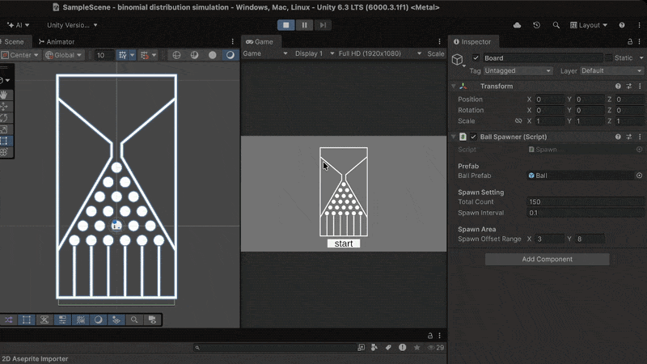

# Binomial-Distribution-Simulation

## 소개
Unity 2D 물리엔진을 활용하여 이항분포를 시각,이론적으로 구현한 프로젝트입니다.

단순 물리엔진이 아닌 수학적 구조를 이용하여 정확하게 50%의 확률로 좌/우 로 이동하게하여, 정규분포를 형성합니다.

## 사용기술
- Unity 2D Physics
- C#
- Rigidbody2D
- Coroutine

## 주요기능
- 공 자동 생성 시스템 (Spawner)
- 핀 충돌 기반 확률 분기
- 다수 공을 통한 분포 형성

## 결과
공들이 아래로 떨어지며 종 모양(정규분포)에 가까운 형태를 형성

## 실행 방법
1. Unity로 프로젝트 열기
2. Scene 실행
3. Spawn 실행

## Demo
